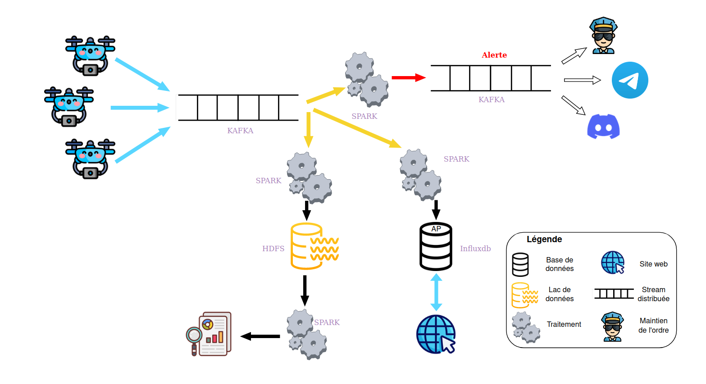
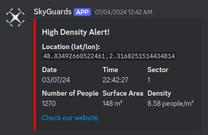
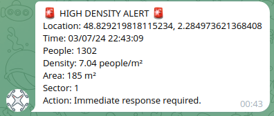
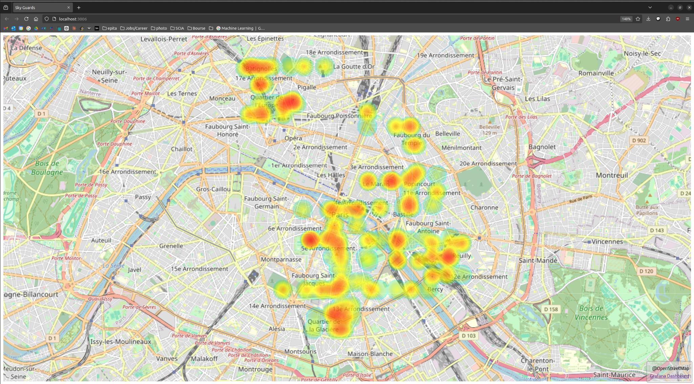

# Data Engineering Project
This repository contains the final project for the data engineering course.

## SkyGuards
SkyGuards is an innovative project designed to prevent mass casualties in crowded spaces. By strategically deploying drones, we monitor crowd density and alert authorities when danger thresholds are exceeded. Our proactive approach aims to reduce the annual toll of 2000 lives lost to overcrowding incidents, enhancing public safety with advanced analytics and real-time insights.

## Workflow

1. **Report Generation and Kafka Streaming**
   - **SkyGuard Drones:** Generate crowd density reports stored in the `./skyguards` directory.
   - **Kafka Stream:** These reports are sent to a Kafka stream for real-time processing. The Kafka setup is resilient, featuring multiple brokers, partitions, and replicas to ensure data durability and safety.

2. **Spark Processing**
   - **Spark Streaming (./spark-streaming):** Consumes reports from the Kafka stream.
     - **Alert System:** Evaluates the reports. If a report indicates a density higher than 7, an alert is sent to both Telegram and Discord servers via another stream.
   - **Influx (./influx):** Another Spark process consumes messages from Kafka.
     - **Data Formatting and Storage:** Formats the messages and stores them in an InfluxDB database.
     - **Web Display:** Displays the data on a website with a map of Paris.
   - **Daily HDFS Reporting:** At the end of each day, this process (the same as Influx) writes data into HDFS (`./hdfs`) and generates report analyses.

## How to Run the Project

```bash
42sh$ docker-compose up all         # Start all services
42sh$ docker-compose up skyguards   # Generate reports
42sh$ docker-compose up analysis    # Run the HDFS service and generate analysis
42sh$ ./start_website.sh            # Start the website
```

## Project Architecture


## Alerts on Telegram & Discord



## Website


## Authors
- Alexandre Devaux-Riviere
- Paul Duhot
- Angelo Eap
